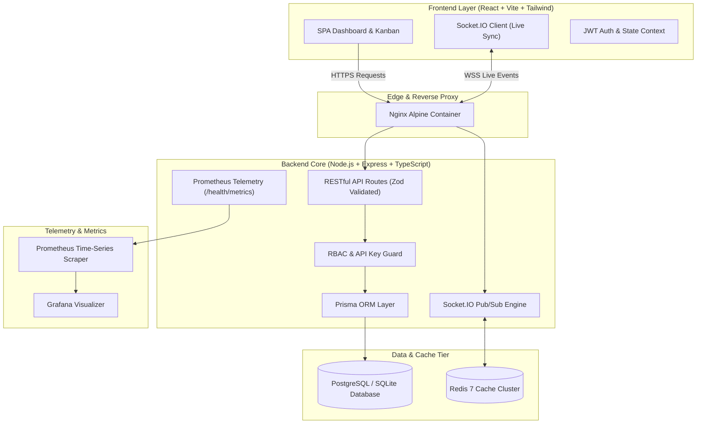

# ⚡ PulseSync SaaS: Production-Ready Incident Operations & Reliability Platform

[](https://github.com)
[](LICENSE)
[](https://nodejs.org)
[](https://www.typescriptlang.org)
[](https://react.dev)
[](https://www.docker.com)
[](https://prometheus.io)
[](http://localhost:5000/api/docs)

PulseSync is an enterprise-grade, multi-tenant SaaS platform built for Site Reliability Engineering (SRE) and DevOps teams to orchestrate real-time incident resolution, track Mean Time to Resolution (MTTR), monitor service health, and automate alerting pipelines.

---

## 🌟 Architecture & Software Engineering Lifecycle



---

## 🚀 Key SaaS Features

1. **Multi-Tenant Authentication & RBAC**:
   - JWT tokens with bcrypt password hashing and automatic workspace isolation.
   - Roles: `ADMIN`, `MANAGER`, `MEMBER`, `VIEWER`.
2. **Real-Time Collaboration**:
   - WebSocket (Socket.IO) engine powering live Kanban board drag-and-drop, typing indicators, and instant incident status synchronization across all active responders without page refreshes.
3. **Observability & Health Dashboard**:
   - Live MTTR tracking, 7-day incident trends, system uptime gauges, and service health grids.
   - Low-level V8 process heap memory, CPU utilization, and WebSocket connection telemetry.
   - Built-in Prometheus scraper endpoint (`/health/metrics`).
4. **Developer-First API & OpenAPI 3.0 Documentation**:
   - Interactive Swagger UI served at `/api/docs`.
   - Programmatic API Key authentication via `X-API-Key` headers for GitHub Actions, Terraform, and Datadog webhooks.
5. **Production Dockerization & Orchestration**:
   - Minimal multi-stage Dockerfiles (`client/Dockerfile`, `server/Dockerfile`).
   - `docker-compose.yml` spinning up PostgreSQL 16, Redis 7, Backend, Nginx Frontend, Prometheus, and Grafana.
6. **Automated CI/CD**:
   - GitHub Actions workflows (`.github/workflows/ci.yml` and `deploy.yml`) for automated linting, database migrations, unit/integration testing, Docker smoke builds, and cloud deployment.

---

## 🔑 Demo Access Credentials

| Role | Email | Password | Permissions |
|---|---|---|---|
| **Admin SRE** | `alex@pulsesync.io` | `PulseDemo2026!` | Full workspace access, API keys, team invitations |
| **SRE Manager** | `sarah@pulsesync.io` | `PulseDemo2026!` | Incident triage, timeline modification |
| **Member Responder** | `marcus@pulsesync.io` | `PulseDemo2026!` | Declare incidents, comment on timelines |
| **Viewer Guest** | `elena@pulsesync.io` | `PulseDemo2026!` | Read-only dashboards and metrics |

> 💡 **Tip**: The login screen features **1-Click Test Drive buttons** to instantly authenticate without typing credentials.

---

## 🛠️ Quickstart Guide

### Option 1: Local Development

#### Prerequisites
- Node.js 20+ or 22+
- npm 10+

#### 1. Setup & Seed Database
```powershell
# Windows PowerShell
.\scripts\setup.ps1

# Or manual execution:
cd server
npm install
npx prisma generate
npx prisma db push
npm run prisma:seed
cd ../client
npm install
```

#### 2. Start Applications
```bash
# Terminal 1: Backend API (Port 5000)
cd server
npm run dev

# Terminal 2: Frontend SPA (Port 5173)
cd client
npm run dev
```

Visit:
- Web App: `http://localhost:5173`
- Interactive Swagger UI: `http://localhost:5000/api/docs`
- Prometheus Metrics: `http://localhost:5000/health/metrics`
- System Telemetry: `http://localhost:5000/health/telemetry`

---

### Option 2: Docker Compose (Full Production Stack)

Spin up the entire distributed cluster (Database, Redis, API, Frontend, Prometheus, Grafana) with a single command:

```bash
docker-compose up --build
```

Access services:
- **Frontend SPA**: `http://localhost`
- **Backend API**: `http://localhost:5000`
- **Prometheus UI**: `http://localhost:9090`
- **Grafana Dashboard**: `http://localhost:3001` (User: `admin`, Pass: `admin`)

---

## 🧪 Automated Testing Suite

PulseSync includes automated end-to-end integration and unit tests covering health probes, authentication, RBAC authorization, incident lifecycles, and API key verification.

To run the test suite:
```bash
cd server
npm test
```

### Test Coverage Results:
```
PASS tests/api.test.ts
  PulseSync SaaS End-to-End API Test Suite
    1. Health & Observability Endpoints
      √ GET /health/live should return 200 OK UP status
      √ GET /health/ready should return 200 OK READY status
      √ GET /health/telemetry should return system stats
      √ GET /health/metrics should expose Prometheus metrics
    2. Authentication & Authorization Flow
      √ POST /api/auth/register should create user, workspace, and issue JWT
      √ POST /api/auth/register should reject duplicate email
      √ POST /api/auth/login should authenticate valid credentials
      √ POST /api/auth/login should reject incorrect password
      √ GET /api/auth/me should return authenticated user profile
      √ GET /api/auth/demo should provide 1-click test credentials
    3. Incidents Lifecycle & Real-Time Sync
      √ POST /api/incidents should create an incident
      √ GET /api/incidents should list incidents for current workspace
      √ GET /api/incidents/:id should retrieve detailed incident
      √ PUT /api/incidents/:id should update status to IDENTIFIED
      √ POST /api/incidents/:id/comments should add communication entry
    4. Analytics & Telemetry Engine
      √ GET /api/analytics/dashboard should return computed SaaS metrics
    5. API Keys & Programmatic Access
      √ POST /api/keys should generate a new API key
      √ GET /api/incidents should authenticate via X-API-Key header

Test Suites: 1 passed, 1 total
Tests:       18 passed, 18 total
```

---

## 🌐 Cloud Deployment

### 1-Click Cloud Deployment (Render Blueprint)
1. Push this repository to GitHub.
2. In Render, select **New -> Blueprint**.
3. Select this repository. The `render.yaml` file will automatically configure the backend Node service, frontend static site, and environment variables.

### Deploying with Docker Containers
Container images can be built and deployed to any Kubernetes cluster (EKS/GKE/AKS), AWS ECS, or Google Cloud Run:
```bash
# Build production images
docker build -t pulsesync-backend:latest ./server
docker build -t pulsesync-frontend:latest ./client
```

---

## 📖 API Documentation Summary

| Method | Endpoint | Access | Description |
|---|---|---|---|
| `POST` | `/api/auth/register` | Public | Register user & tenant workspace |
| `POST` | `/api/auth/login` | Public | Authenticate & receive JWT |
| `GET` | `/api/auth/demo` | Public | 1-Click test credentials |
| `GET` | `/api/auth/me` | Bearer | Retrieve authenticated user profile |
| `GET` | `/api/incidents` | Bearer / Key | List workspace incidents (filters & search) |
| `POST` | `/api/incidents` | Member+ | Declare a new incident |
| `PUT` | `/api/incidents/:id` | Member+ | Transition incident state |
| `POST` | `/api/incidents/:id/comments` | Member+ | Append timeline communication update |
| `GET` | `/api/analytics/dashboard` | Bearer | MTTR, trends, and service health stats |
| `POST` | `/api/keys` | Admin | Provision programmatic API keys |
| `GET` | `/health/live` | Public | Kubernetes liveness probe |
| `GET` | `/health/ready` | Public | Readiness probe (DB check) |
| `GET` | `/health/metrics` | Public | Prometheus exposition endpoint |

---

## 📄 License
This project is licensed under the MIT License.
